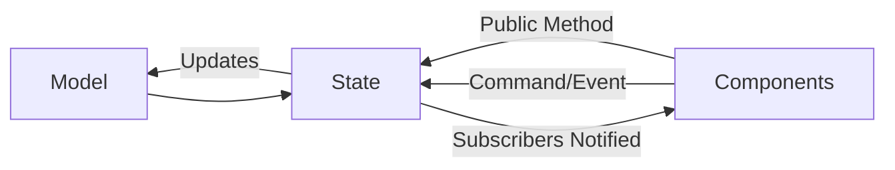

# State Management in Siren

Siren uses a simplified Flux/Redux-inspired architecture called Model State Components for state management that maintains unidirectional data flow while reducing boilerplate code.

## Core Concepts

### Architecture Overview



The architecture consists of three main parts:

- **Model**: Represents the application data structure, can encapsulate logic
- **State**: Manages data updates, exposes public operations for the model
- **Components**: UI elements that display data and handle user interactions

### Key Principles

1. **Unidirectional Data Flow**

   - Data flows in one direction: Model -> State -> Components
   - Components never directly modify the Model
   - State acts as a barrier between UI and business logic

2. **State as Single Source of Truth**

   - Each domain has a dedicated State class
   - State maintains the current Model
   - Components subscribe to State changes
   - State is registered as in the DI container
     - Singleton for WebAssembly
     - Scoped for Server

3. **Message Bus for Decoupled Communication**
   - Optional event-based communication between components
   - Useful for cross-cutting concerns
   - States can subscribe to events that persist even when UI is not active
   - Components will automatically update from State, so values cannot be returned from a Command/Event.

## Implementation

### State Class Example

    ```csharp
    public class State
    {
        public string Name { get; private set; }

        public event Action? StateChanged;

        public void NotifyStateChanged() => Action?.Invoke();

        public void Update(string name)
        {
            Name = name;
            NotifyStateChanged();
        }
    }
    ```

### Component Usage Example

    ```csharp
    @implements IDisposable

    <div>@_state.Text</div>

    @code {
        [Inject] public State _state { get; set; } = default!;

        protected override void OnInitialized()
        {
            _state.StateChanged += StateHasChanged;
        }

        public void Dispose()
        {
            _state.StateChanged -= StateHasChanged;
        }
    }
    ```

## Comparison to Other Patterns

### Differences from Flux/NgRx

- No explicit action creators/types
- No reducer functions
- Optional message bus instead of mandatory dispatcher
- C# events/delegates instead of Observable streams
- No built-in undo/redo

### Shared Concepts

- Unidirectional Data Flow
- Actions similar to publishing a Command
- Keeps data fetching at the outer boundary

### Differences from MVVM (Model-View-ViewModel)

### MVVM Architecture


### Key Differences

1. **Direction of Data Flow**

   - MVVM uses two-way binding between ViewModel and View
   - MSC enforces unidirectional data flow from Component through State to Model
   - MSC's unidirectional flow makes state changes more predictable

2. **Role of the Middle Layer**

   - ViewModel acts as a data transformer/adapter for the View
   - State acts as a business logic container and gatekeeper for Model updates
   - State is more focused on behavior, ViewModel more on data presentation

3. **UI Coupling**

   - ViewModel often contains UI-specific logic and presentation data
   - State is UI-agnostic and could be used with different UI frameworks
   - Components handle all UI-specific concerns

4. **Change Notification**
   - MVVM typically uses property-level change notification (INotifyPropertyChanged)
   - MSC uses coarser-grained state change events
   - MSC's approach reduces boilerplate but may cause more UI refreshes

### Shared Concepts

Both patterns:

- Separate business logic from UI
- Use dependency injection for composition
- Maintain the Model as the core data structure
- Support testability through separation of concerns

### Structural Philosophy

1. **State Sharing vs View Model Isolation**

   - MVVM typically creates dedicated ViewModels for each View
   - ViewModels are usually tightly coupled to their specific Views
   - MSC encourages sharing State across multiple Components
   - State represents a complete feature or domain concern

2. **Granularity and Organization**

   - MVVM organizes by View/ViewModel pairs
   - MSC organizes by feature verticals
   - State classes align with business domains rather than UI structure
   - Fewer classes overall in MSC due to shared state

3. **Data Loading and Model Composition**

   - MVVM often fragments Models to match View-specific needs
   - ViewModels frequently contain data-fetching logic
   - MSC loads complete Model contexts within State
   - Components select needed data from complete Models
   - No performance penalty as data is already in memory

   ```mermaid
   graph TB
       subgraph MVVM
           VM1[ViewModel 1] --- V1[View 1]
           VM2[ViewModel 2] --- V2[View 2]
           VM3[ViewModel 3] --- V3[View 3]
           M1[Model] --> VM1
           M1 --> VM2
           M1 --> VM3
       end

       subgraph MSC
           M2[Model] --> S[State]
           S --> C1[Component 1]
           S --> C2[Component 2]
           S --> C3[Component 3]
       end
   ```

This structural difference reflects MSC's focus on domain-driven design principles, where state boundaries align with business capabilities rather than UI requirements.
